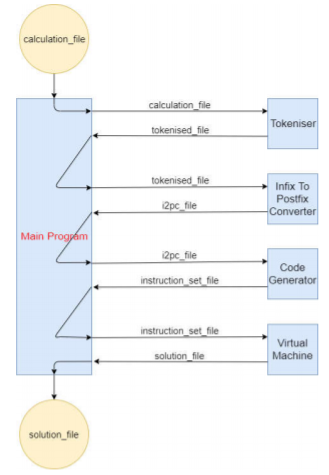

The calculator will consist of 4 programs: 

1. Tokenizer 2. Infix to Postfix Converter 3. Code Generator 4. Virtual Machine 

Each of these programs will be called from a "Main" program, which will act as the interface between the four system components. The Main takes a file of calculations as input and passes the first line of that file into the first program, the Tokeniser. 
This line is expected to be a calculation eg.“ 1+27(3-4)". 

1. Tokeniser 
The input file line is split up and outputted to a new file (tokenised_file). o Each character from the input is printed to a new line in tokenised_file. o The Tokeniser distinguishes between integers, floating point numbers, operators 
and parentheses, while ignoring whitespace and commas (“,"). o If a character is not valid then an error will be returned. 
If all characters are valid and no errors occur then the tokenised_file will be returned. 

2. Infix to Postfix Converter 
The 12PC program takes the tokenised_file as input and converts the calculation 
from Infix Notation to Postfix Notation. o Eg. (2+3)*4 Becomes: 23+4* 
2+3*4 
Becomes: 
234*+ 
This conversion will be implemented using the Shunting Yard Algorithm (Edsger Dijkstra), and will respect the order of operations and parentheses. The postfix notation calculation will be returned on a single line in a separate file (i2pc_file).

3. Code Generator 
The Code Generator takes the i2pc_file as input and generates an instruction set 
based off the postfix notation calculation. O Tokens are read one at a time from the input file and instructions for the Virtual 
Machine (Program 4) are appended to a new instruction_set_file accordingly. o Supported instructions: 
LOADINT I ADD 
SUB 
MUL I DIV 
EXP 
MOD O The instruction_set_file will be returned to be used as input in the final program. 
ins 
4. Virtual Machine 
The Virtual Machine (VM) is the final program in the system and takes the 
instruction_set_file created in the Code Generator as input. O The VM implements a stack to perform operations. o Instructions are read one at a time from the instruction_set_file and executed in 
the VM. o The execution process is as follows: 
Numbers are loaded to the stack. When an operation instruction is reached, the last two numbers added to the stack are popped, the operation is performed and the result is pushed back onto the stack. 
This process is repeated until only one result remains on the stack. o When only one number remains, it will be popped from the stack and appended 
to a solution_file. O The solution_file will be returned to the Main. 
This 4 program process will be repeated for each following line in the initial input file (each of which is an individual calculation). Once all calculations are complete, the contents of the solution_file will be printed to stdout. Should an error occur, an error message will be printed on the line in the solution file where the correct answer would have otherwise appeared. If one line of arithmetic produces an error, the program should still continue to compute solutions for any remaining unsolved lines in the input file. 

Interface Between Components 
For this calculator design, we will implement a "Main" class that will act as an interface between the four system programs (Tokeniser, 12PC, Code Generator and Virtual Machine). 
Main 
A function will be created which requires an input file from the user. The user can invoke this by calling the Main, then the main will return a message request path to the file. 
After getting the path, Main takes in input file containing equations to be solved and create a directory called temp. 
L One line of the file is read at a time, one equation is allowed per 
line. For each line, 
Run Tokenizer on that line. Output from this will be a tokenised_file where all tokens in a given calculation have been separated. This file is located in the temp directory. 
Call Infix to Postfix (i2p), passing in the path to tokenized file, output a postfix format of tokenised_file in i2pc_file to temp. 
Call Code Generator, passing in path to i2pc_file, return instructions which are executable by C in instruction_set_file to temp. 
Call Virtual Machine execute instruction_set_file - Integer value returned from Virtual Machine is written to a solution_file (this text file is in the same directory as the codes). Then wipe the files in temp 
directory Move on to next line. Every step is the same but the result from the VM is appended to solution_file, the file is not overridden.. 
When the end of the input file is reached, Main will read in solution_file, read through each line and use "stdout" to print out the result. 

Fig. 1. Example of single player game

Fig. 2. Example of multi-player game
 
